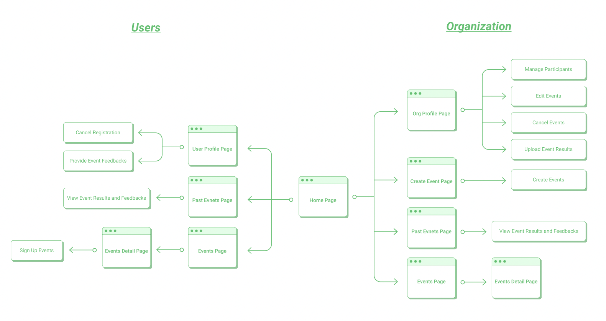

# [Volunteer](https://volunteer-c29d0.web.app)

> _Together We Can Make A Difference!_

- A volunteer events platform that lets users to join events and provide feedbacks easily
- Registered organizations are allowed to create their own events and manage participants

## Demo

- https://volunteer-c29d0.web.app

### Test Account

- User: volunteer@gmail.com / Password: 000000
- Organization: organization@gmail.com / Password: 000000

## Technologies

### Front-End Fundamentals

- HTML/CSS/JavaScript
- RWD

### Front-End Frameworks and Libraries

- React (Hook)
- React Router
- Redux

### Cloud Service

- Firebase Authentication
- Firebase Firestore
- Firebase Storage

### User Interface

- styled-components
- React-Bootstrap

### Other

- react-datepicker
- react-toastify
- react-google-places-autocomplete
- react-dropdown
- react-loading
- react-minimal-pie-chart

## Flow Chart

## Features

- User login

### Events Page

- Explore volunteer events
- Sign up for volunteer events

### Create Event Page (Organization)

- Create new events with tags and the accurate location

### Profile Page (Organization)

- Manage applicants and participants
- Edit / Cancel volunteer events
- Upload event results

### Profile Page (User)

- Manage my volunteer events
- Provide feedbacks

### Past Events Page

- View past events and participants' feedbacks

## Future Features

- Send notification emails to confirmed participants
- Allow organizations to reactivate the cancelled events

## Contact

email: anniechi1020@gmail.com
